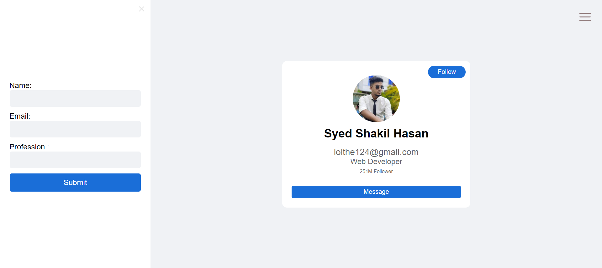

## Get User Data From Input



```jsx
const [userdata, setUserdata] = useState({
  name: "",
  email: "",
  profession: "",
});
const { name, email, profession } = userdata;

const changeHandler = (event) => {
  const name = event.target.name;
  setUserdata((userdata) => {
    return {
      ...userdata,
      [name]: event.target.value,
    };
  });
};

const submitHandler = (event) => {
  event.preventDefault();

  // Create an object with the input data and pass it to the User component
  const inputData = {
    name: name,
    email: email,
    profession: profession,
  };
  if (name === name && email === email && profession === profession) {
    document.querySelector(".userProfile").style.display = "block";
  }
  // Pass the inputData object to the User component
  setInputdata(inputData);
  setUserdata({ name: "", email: "", profession: "" });
};

const [inputdata, setInputdata] = useState({});
```
